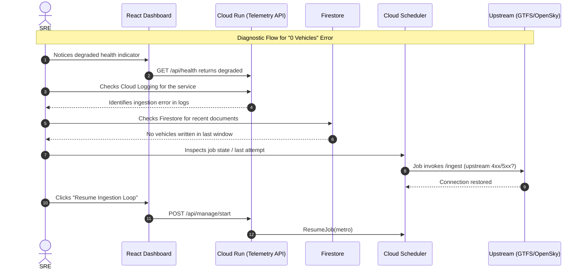

# Operations Runbook — GCP Telemetry Platform — SRE Runbook



**Last updated:** 2026-07
**Owner:** Platform SRE
**Scope:** Production incident response for all components

---

## Table of Contents

1. [Service Overview](#1-service-overview)
2. [Health Checks](#2-health-checks)
3. [Alert Playbooks](#3-alert-playbooks)
   - 3.1 Metro Feed Stale
   - 3.2 Flight Feed Stale
   - 3.3 API High Error Rate
4. [Common Operational Tasks](#4-common-operational-tasks)
5. [Escalation Path](#5-escalation-path)

---

## 1. Service Overview

| Component | Resource | Service | Criticality |
|---|---|---|---|
| Telemetry API + SPA | `telemetry-api` | Cloud Run | High |
| Metro ingestion trigger | `metro-ingester` | Cloud Scheduler | Medium |
| Flight ingestion (off-cloud) | flight pusher → `POST /ingest/flight/push` | External host (residential IP) | Medium |
| Datastore | `vehicles` collection (24h TTL) | Firestore (native) | High |
| Secrets | `OPENSKY_CLIENT_ID` / `OPENSKY_CLIENT_SECRET` / `INGEST_PUSH_TOKEN` | Secret Manager | High |
| Container images | `telemetry-repo` | Artifact Registry | Medium |

**SLO:** `/api/health` returns HTTP 200 with `status: "healthy"` for ≥99% of minutes in a 30-day rolling window.

### GCP Console Quick Links

*(Replace `PROJECT_ID` and `REGION` with your environment, e.g. `gcp-telemetry-platform` / `europe-west3`.)*

- 📊 **[Cloud Run Service](https://console.cloud.google.com/run/detail/REGION/telemetry-api/metrics?project=PROJECT_ID)** — Request count, latency, instance count, error rate
- 📈 **[Cloud Logging (Logs Explorer)](https://console.cloud.google.com/logs/query?project=PROJECT_ID)** — Filter by `resource.type="cloud_run_revision"`
- ⏰ **[Cloud Scheduler Jobs](https://console.cloud.google.com/cloudscheduler?project=PROJECT_ID)** — Inspect `metro-ingester` state and last run
- 🔥 **[Firestore Data](https://console.cloud.google.com/firestore/databases/-default-/data?project=PROJECT_ID)** — Browse the `vehicles` collection
- 🔐 **[Secret Manager](https://console.cloud.google.com/security/secret-manager?project=PROJECT_ID)** — OpenSky credentials + flight push token

---

## 2. Health Checks

> [!NOTE]
> **Telemetry Window Discrepancy**
> There is a deliberate polling window discrepancy separating the data retrieval endpoints. `GetActiveVehicles` (used by the dashboard map) operates on a **12m window** — comfortably above the 5-min ingest interval so a query landing just before the next poll never drops vehicles. In contrast, the source health monitor uses a padded **10m window** for OpenSky. This intentional buffer prevents SRE dashboard noise and false-positive pipeline teardowns caused by brief upstream provider latency, Cloud Run cold starts, or expected sub-minute schedule gaps.

### Quick status commands

```bash
# API health (should return {"status":"healthy",...})
SERVICE_URL=$(gcloud run services describe telemetry-api --region "$REGION" --format='value(status.url)')
curl "$SERVICE_URL/api/health" | jq .

# OpenSky pipeline status
curl "$SERVICE_URL/api/manage/opensky-status" | jq .

# Cloud Scheduler job state (paused vs enabled)
gcloud scheduler jobs describe metro-ingester  --location "$REGION" --format='value(state)'
```

### Cloud Logging queries (Logs Explorer)

The service logs ingestion counts and errors to Cloud Logging. Use these filters in the Logs Explorer.

**Recent ingestion activity:**
```
resource.type="cloud_run_revision"
resource.labels.service_name="telemetry-api"
textPayload:("Ingested" OR "Parsed")
```

**Errors only:**
```
resource.type="cloud_run_revision"
resource.labels.service_name="telemetry-api"
severity>=ERROR
```

**Pause ingestion to let the demo idle overnight (saves invocation cost):**
```bash
gcloud scheduler jobs pause metro-ingester --location "$REGION"
```

---

## 3. Alert Playbooks

### 3.1 Metro Feed Stale

**Condition:** `/ingest/metro` is being invoked, but Firestore shows 0 new `metro` documents over several minutes.
**Meaning:** The metro ingestion worker is running but the Capital Metro GTFS-RT feed is returning 0 vehicles.

**Investigation steps:**

1. Confirm the scheduler job is enabled and firing:
   ```bash
   gcloud scheduler jobs describe metro-ingester --location "$REGION" \
     --format='value(state, lastAttemptTime, status.code)'
   ```

2. Check Cloud Run logs for the ingestion result:
   ```
   resource.labels.service_name="telemetry-api"
   textPayload:("metro" OR "GTFS-RT")
   ```

3. Verify the upstream feed is accessible and non-empty:
   ```bash
   curl -s "https://data.texas.gov/download/eiei-9rpf/application/octet-stream" | wc -c
   # A value < 100 bytes suggests an empty or error response (HTML instead of protobuf)
   ```

**Resolution:**
- If the feed URL is down: self-resolving when Capital Metro restores the feed. Update the status page.
- If the scheduler job is paused: resume it via the dashboard ("Resume Ingestion Loop") or
  `gcloud scheduler jobs resume metro-ingester --location "$REGION"`.
- If the feed returns HTML: the parser rejects it (`feed returned HTML instead of protobuf`); wait for upstream recovery.

---

### 3.2 Flight Feed Stale

**Condition:** no fresh `flight` documents appear in Firestore (the off-cloud pusher has stopped POSTing to `/ingest/flight/push`).

> [!IMPORTANT]
> **Known limitation (verified 2026-06-18): OpenSky blocks GCP egress.**
> OpenSky's API host (`api.opensky-network.org` / `opensky-network.org`) **silently drops TCP connections from GCP datacenter IPs**, producing `dial tcp ...:443: i/o timeout` on every flight fetch made from Cloud Run. This was confirmed in `europe-west3` with a dedicated static NAT IP in OAuth2-authenticated mode — i.e. region and static IP do **not** bypass the block. The same OpenSky endpoint returns HTTP 200 instantly from a non-cloud (residential/ISP) IP, and the Metro feed works fine from GCP egress, so this is **OpenSky IP-level blocking of cloud datacenter ranges**, not a rate-limit, outage, or misconfiguration.
>
> **Resolution (implemented):** flights are no longer fetched from GCP. An off-cloud **flight pusher** runs on a residential host, fetches OpenSky from an unblocked IP, and POSTs aircraft to `POST /ingest/flight/push` (guarded by `INGEST_PUSH_TOKEN`). The earlier VPC connector + Cloud NAT + static-IP stack — which existed only to chase this block — has been removed. Metro telemetry is unaffected.

**Likely causes (the off-cloud pusher is the source of all flight data):**
- The flight pusher process/host is down, lost connectivity, or its `INGEST_PUSH_TOKEN` no longer matches the Secret Manager value.
- Legitimate low traffic at 3–5 AM local time (very few aircraft over Austin).
- HTTP 429 rate-limit at the pusher → it backs off and resumes automatically. Anonymous OpenSky allows ~400 credits/day; authenticated (`OPENSKY_CLIENT_ID`/`SECRET`) raises this to ~4000/day. Quota resets at 00:00 UTC.

**Investigation steps:**

1. Confirm the cloud side is accepting pushes — look for push activity / auth failures in the logs:
   ```
   resource.labels.service_name="telemetry-api"
   textPayload:("flight/push" OR "INGEST_PUSH_TOKEN" OR "unauthorized")
   ```
   - `401 unauthorized` on `/ingest/flight/push` → token mismatch; re-sync the pusher's token with Secret Manager.
   - No push log lines at all → the pusher is not reaching the service (check the pusher host).

2. Check the pusher host itself (see `deploy/homebox/README.md`) — process status and its OpenSky fetch logs.

3. Confirm OpenSky itself is up, from the **pusher's (non-cloud) IP**:
   ```bash
   curl -s "https://opensky-network.org/api/states/all?lamin=29.8&lomin=-98.2&lamax=30.8&lomax=-97.2" | jq '.states | length'
   # Daytime: 10–100+ aircraft. A direct fetch from GCP will time out — that block is expected and is why the pusher exists.
   ```

**Note:** do **not** try to "fix" flights by fetching from Cloud Run — OpenSky blocks GCP IPs by design (see the resolution above). All flight data must continue to flow through the off-cloud pusher.

---

### 3.3 API High Error Rate

**Condition:** Cloud Run is returning elevated HTTP 5xx, or the dashboard health card shows degraded.

**Investigation steps:**

1. Check the Cloud Run metrics blade for request error rate and latency.

2. Inspect exceptions in Logs Explorer:
   ```
   resource.type="cloud_run_revision"
   resource.labels.service_name="telemetry-api"
   severity>=ERROR
   ```

3. Common causes and fixes:

   | Symptom | Cause | Fix |
   |---|---|---|
   | `PermissionDenied` on Firestore | Cloud Run SA missing `roles/datastore.user` | Re-apply Terraform IAM bindings |
   | `failed to init scheduler client` | SA missing `roles/cloudscheduler.admin` | Re-apply Terraform IAM bindings |
   | Secret access denied | SA missing `roles/secretmanager.secretAccessor` | Re-apply Terraform IAM bindings |
   | Cold-start latency spikes | New revision / scaled to zero | Set min instances if sustained traffic warrants |
   | 503 from Cloud Run | Revision unhealthy / deploying | Wait for the new revision to pass health checks |

4. Emergency: roll back to the previous healthy revision:
   ```bash
   gcloud run services update-traffic telemetry-api --region "$REGION" \
     --to-revisions PREVIOUS_REVISION=100
   ```

---

## 4. Common Operational Tasks

### Deploy / redeploy

Deployments build a new image (timestamp-tagged) and apply Terraform. The primary path is CI/CD (GitHub Actions → Artifact Registry → Terraform apply); `deploy.sh` uses Cloud Build as a local/break-glass alternative:

```bash
./deploy.sh
```

### Rotate OpenSky credentials

```bash
printf 'NEW_CLIENT_ID'     | gcloud secrets versions add OPENSKY_CLIENT_ID     --data-file=-
printf 'NEW_CLIENT_SECRET' | gcloud secrets versions add OPENSKY_CLIENT_SECRET --data-file=-
# Cloud Run reads "latest"; redeploy or roll a new revision to pick it up.
```

### Manually trigger an ingestion run

```bash
gcloud scheduler jobs run metro-ingester --location "$REGION"
# Flights are pushed from the off-cloud host, not triggered by Cloud Scheduler —
# see deploy/homebox/README.md to run the pusher manually.
```

### Inspect the data directly (break-glass)

Use the built-in debug endpoint or browse Firestore:

```bash
curl "$SERVICE_URL/api/debug/inspect" | jq .
```

### Pause / resume ingestion

```bash
# Pause (demo-at-rest)
gcloud scheduler jobs pause  metro-ingester --location "$REGION"
# Resume
gcloud scheduler jobs resume metro-ingester --location "$REGION"
```

### Full teardown (demo-at-rest)

```bash
./destroy.sh   # destroys Cloud Run/Scheduler; preserves Firestore data + secrets
```

---

## 5. Escalation Path

| Level | Contact | When |
|---|---|---|
| L1 | On-call engineer (alert notification) | Any alert fires |
| L2 | Platform SRE lead | Alert not resolved within 30 minutes |
| L3 | Google Cloud Support | Confirmed GCP platform issue (check [status.cloud.google.com](https://status.cloud.google.com)) |
